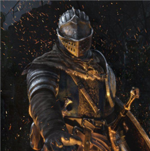
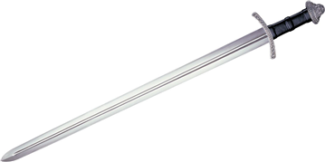
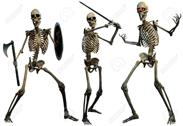
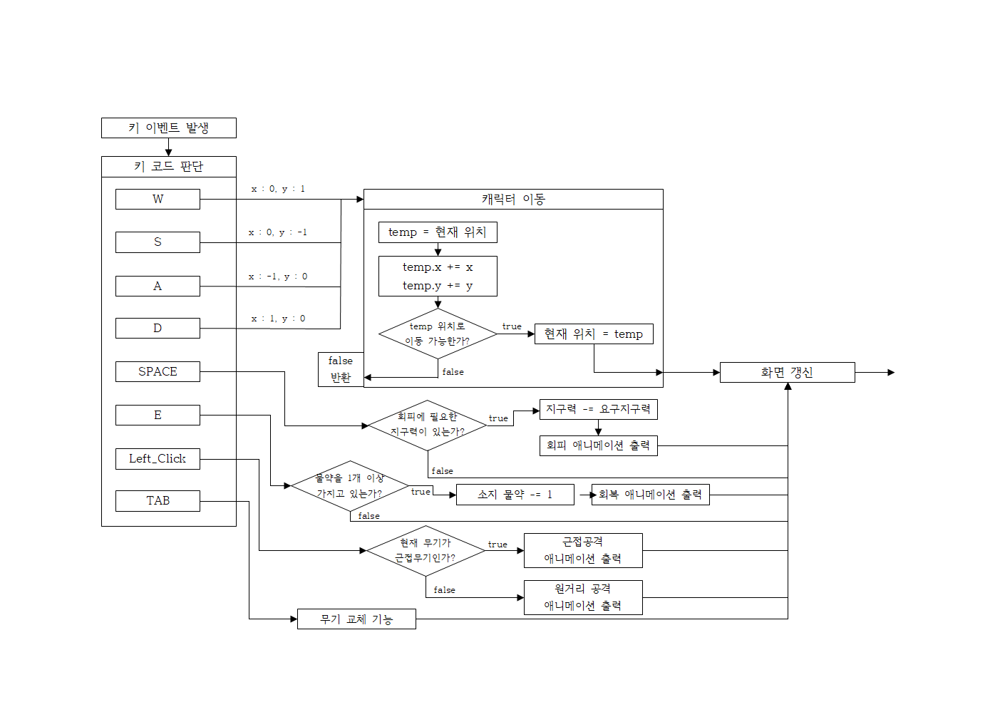
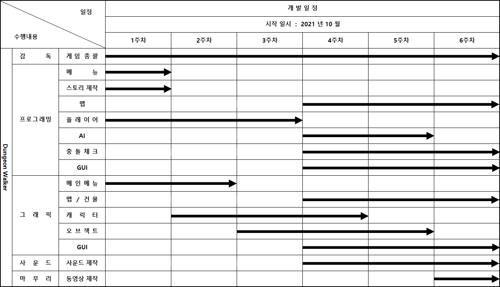

# [ 목차 ]

### 1. [게임명: Dungeon Walker](#0)
### 2. [컨셉](#1)
### 3. [관련 동영상](#2)
### 4. [대표 이미지](#3)
### 5. [컨셉과 대표이미지 기반 작품 묘사](#3-1)
### 6. [Dungeon Walker의 구성 요소](#4)
### 7. [게임 시스템 디자인](#5)
#### &nbsp;&nbsp;&nbsp;&nbsp; a. [게임 오브젝트 분해](#5-1)
#### &nbsp;&nbsp;&nbsp;&nbsp; b. [파라미터(속성)](#5-2)
#### &nbsp;&nbsp;&nbsp;&nbsp; c. [행동](#5-3)
#### &nbsp;&nbsp;&nbsp;&nbsp; d. [상태](#5-4)
#### &nbsp;&nbsp;&nbsp;&nbsp; e. [플레이어 캐릭터 속성(파라미터)](#5-5)
#### &nbsp;&nbsp;&nbsp;&nbsp; f. [게임의 규칙](#5-6)
#### &nbsp;&nbsp;&nbsp;&nbsp; g. [게임에서 사용될 공식](#5-7)
### 8. [개발 요구사항 & 흐름도](#6)
#### &nbsp;&nbsp;&nbsp;&nbsp; a. [요구사항(1년)](#6-1-1)
#### &nbsp;&nbsp;&nbsp;&nbsp; b. [요구사항(6주)](#6-1-2)
#### &nbsp;&nbsp;&nbsp;&nbsp; c. [키보드 이벤트에 대한 흐름도](#6-2)
### 9. [개발작업 일정(6주)](#7)

# [게임명: Dungeon Walker]
  

# [컨셉] 

## 메인컨셉 : 랜덤

- ‘무작위의’ 의미를 가진 단어이며 ‘로그라이크’ 라는 장르에 가장 중요한 요소로
   플레이 중 적과 플레이어를 강화하는 요소가 무작위로 등장
   
### 서브 컨셉 1 : 난이도

- 어느정도 어렵게 만들어 게임을 지루하지 않게 개발

### 서브 컨셉 2 : 복잡성

- 게임을 클리어하는데 한 가지의 방법만이 아닌 여러 가지 방법을 제시

### 서브 컨셉 3 : 탐험

- 무작위로 정해지는 지형으로 플레이어가 새 게임을 시작할 때마다 새로운 경험을 하게 만듬

### 서브 컨셉 4 : 성장

- 캐릭터를 강화하는 요소가 랜덤으로 나와 매번 다르게 성장하는 재미

### 서브 컨셉 5 : 영구적 죽음

- 게임에서 사망할 경우 진행했던 모든 것이 사라지며 새 게임을 진행해야 한다

  

# [관련 동영상] 

- 동영상

  

  

# [대표 이미지] 

  

# [컨셉 & 대표이미지 기반 작품묘사] 

> ### 대표이미지 기반 : 
> 화면 왼쪽위에 체력과 지구력을 표시한 ui가있고 중앙엔 유저의 캐릭터 주변엔 적 캐릭터가 있다.
  왼쪽아래에는 현재 플레이어가 무슨 무기를 들고있는지 표시해주고 오른쪽아래에는 가지고있는 체력을 회복시켜주는 물약의 개수가 표시되어 있다. 

> ### 컨셉 기반:

  

# [Dungeon Walker 구성 요소] 

- 캐릭터를 성장시키며 강력한 보스에게 도전하는 액션 로그라이크게임

 

## 1. 메커니즘

[도전 과제]

낮은 기본 능력치로 초반 어려운 난이도로 진행하며
게임이 진행될수록 강해지며 보스를 처치하여 게임을 클리어

[재미 요소]

게임을 진행하며 랜덤한 성장요소로 강해지는 캐릭터

 

## 2. 이야기

[만들게 된 배경]  
평소 로그라이크 장르의 게임을 했었을 때 
나도 언젠가 한번 로그라이크 게임을 만들어보고 싶다 라고
생각했었기에 이번 기회에 만들어보자 라고 생각했다

[카메라 관점]  
기본적으로 쿼터뷰이며 이는 게임중 변할수도있다

 

## 3. 미적요소

[디자인][컬러]  
어두운 지하유적을 배경으로 디자인할 예정이며
흑색과 검은색의 돌벽,바닥에 횃불느낌을 내도록 주황색 광원효과를 줄 예정이다

[음향]  
현실적인 묵직한느낌의 효과음
 

## 4. 기술

Unity

# [게임 시스템 디자인] 

## a. 게임 오브젝트 분해 (구성 요소 분석) 

|연번|오브젝트 이름|오브젝트 이미지|
|:----:|:----:|:----:|
|1|Player||
|2|Sword||
|3|Gun||
|4|Enemy||

## b. 파라미터(속성) 뽑아 보기 

1) 오브젝트 이름 : Player

|속성|영문명칭|설명|비고|
|:----:|:----:|:----:|:----:|
|체력|p_HP|플레이어의 체력이며, 1미만일 경우 게임오버된다.||
|지구력|p_SP|플레이어의 지구력이며, 일정이상일 경우 회피를 할 수 있다.||
|이동속도|p_Speed|플레이어의 이동속도이며, 높을수록 캐릭터의 움직이는 속도가 빨라진다.||
|탄약|p_Ammo|플레이어가 가지고 있는 탄약이며, 탄약을 가지고있지 않을 경우 재장전을 하지않는다.||
|물약|p_potion|플레이어가 가지고 있는 물약이며, 플레이어의 체력을 회복할 수 있다.||
|무기|p_Weapon|플레이어가 현재 들고있는 무기이다.||

2) 오브젝트 이름 : Sword

|속성|영문명칭|설명|비고|
|:----:|:----:|:----:|:----:|
|위력|s_Dmg|근접공격의 위력이며, 수치가 높을수록 적에게 더 큰 피해를 입힐 수 있다.||
|사거리|s_Range|근접공격의 사거리이며, 수치가 높을수록 더 넓은 범위로 공격을 할 수 있게된다.||
|공격속도|s_Speed|근접공격의 공격속도이며, 수치가 높을수록 더 빠른속도로 공격할 수 있다.||

3) 오브젝트 이름 : Gun

|속성|영문명칭|설명|비고|
|:----:|:----:|:----:|:----:|
|위력|g_Dmg|원거리공격의 위력이며, 수치가 높을수록 적에게 더 큰 피해를 입힐 수 있다.||
|사거리|g_Ammo|원거리공격의 탄약이며, 1미만일 경우 원거리공격을 할 수 없게된다.||
|공격속도|g_Reload|원거리공격의 장전속도이며, 수치가 높을수록 더 빠른속도로 장전하여 더 빠르게 공격할 수 있다.||

4) 오브젝트 이름 : Enemy

|속성|영문명칭|설명|비고|
|:----:|:----:|:----:|:----:|
|체력|e_HP|적의 체력이며, 1미만일 경우 소멸한다.||
|위력|e_Dmg|적의 위력이며, 수치가 높을수록 플레이어에게 입히는 피해가 커진다.||
|이동속도|e_Speed|적의 이동속도이다.||

## c. 행동 뽑아 보기 

1) 오브젝트 이름 : Player

|행동|설명|
|:----:|:----:|
|공격|플레이어가 공격키를 누르면 현재 캐릭터가 들고있는 무기로 공격을 한다.|
|회피|플레이어가 회피키를 누르면 지구력의 일부를 소모해 회피를한다.|
|이동|플레이어가 이동키를 누르면 누른 방향으로 이동한다.|
|사망|플레이어의 체력이 1미만이 되면 캐릭터가 사망하고 게임오버된다|

2) 오브젝트 이름 : Enemy

|행동|설명|
|:----:|:----:|
|공격|플레이어를 향해 공격한다.|
|이동|플레이어의 주변을 맴돌며 움직인다.|
|사망|공격을받아 체력이 1미만이 되면 소멸한다.|

## d. 상태 뽑아 보기 

1) 오브젝트 이름 : Player

|현상태|전이상태|전이조건|
|:----:|:----:|:----:|
|대기|피격|적에게 공격을 받았을 때|
|피격|대기|체력이 1이상일 경우|
|피격|사망|체력이 1미만일 경우|
|대기|공격|공격키를 눌렀을 때|

2) 오브젝트 이름 : Enemy

|현상태|전이상태|전이조건|
|:----:|:----:|:----:|
|대기|피격|플레이어에게 공격을 받았을 때|
|피격|대기|체력이 1이상일 경우|
|피격|사망|체력이 1미만일 경우|
|대기|공격|플레이어가 공격범위안에 있을 때|

## e. 플레이어 캐릭터 속성(파라미터) 

|속성|영문명칭|설명|
|:----:|:----:|:----:|
|체력|p_HP|플레이어의 체력|
|지구력|p_SP|플레이어의 지구력|
|이동속도|p_Speed|플레이어의 이동속도|
|탄약|p_Ammo|플레이어가 가지고 있는 탄약|
|물약|p_potion|플레이어가 가지고 있는 물약|
|무기|p_Weapon|플레이어가 현재 들고있는 무기|

## f. 게임의 규칙 

1) 핵심 규칙

   적을 처치하며 진행하며 보스들을 처치하고 마지막 보스를 처치하는 것

2) 보조 규칙

   - 게임에는 여러 방이 존재하고 방에 있는 적을 모두 처치할 경우
     랜덤으로 능력치를 상승시킬 수 있는 기회가 주어진다. 
     
   - 보스를 처치할 경우 랜덤으로 능력치를 크게 상승시킬 수 있는
     기회가 주어진다. 
     
   - 체력을 모두 소모하여 게임오버될 경우 진행상황이 전부 리셋되어
     처음부터 다시시작해야한다.
     
     
## g. 게임에서 사용될 공식 

   게임을 진행하며 능력치를 상승시킬 때 기본능력치에 일정수치를 더하거나 곱한다.
   
   
     
   
# [개발 요구사항 & 흐름도] 

## a. 요구사항(1년) 

  •시작화면, 게임화면, 결과화면 3개의 화면이 있다.
  
  •시작화면에는 시작하기와 설정, 게임종료 버튼 3개가 있다.
  
  •시작하기 클릭 시 게임화면으로 이동한다.
  
  •설정 클릭 시 설정화면으로 이동한다.
  
  •게임종료 버튼을 클릭 시 게임이 종료된다.
  
  •설정화면에서는 돌아가기 버튼이 있고 클릭 시 시작화면으로 이동한다.
  
  •시작화면에서 시작하기를 누르면 게임화면으로 변경된다.
  
  •게임화면에는 가지고 있는 물약, 무기종류, 플레이어의 캐릭터, 적, 체력과 지구력, 메뉴버튼, 경과한 시간이 표시된다.
  
  •게임화면의 중앙에는 플레이어의 캐릭터가 있다.
  
  •스테이지는 여러개가 있으며, 해당 스테이지의 보스를 처치하면 다음 스테이지로 넘어갈 수 있게된다. 
  
  •스테이지는 랜덤으로 이루어지며, 매번 할 때마다 맵 구조가 달라진다.. 
  
  •조작은 WASD로 이동, 마우스커서방향으로 캐릭터회전, 스페이스바는 회피, 왼쪽클릭으로 공격, E키로 물약을 먹을 수 있다.
  
  •게임의 종료 조건은 플레이어의 체력이 모두 소모되어 사망하거나, 마지막 스테이지의 보스를 처치 했을때 종료된다.
  
  •게임 종료 시 종료 팝업이 뜬다. 종료팝업에는 플레이 시간, 처음으로 버튼, 다시하기 버튼, 종료 버튼이 있다.
  
  ## b. 요구사항(6주) 
  
•메인메뉴 구현
  
&nbsp;&nbsp;&nbsp;&nbsp;1) ~~메인메뉴 뒷 배경 구현~~
     
&nbsp;&nbsp;&nbsp;&nbsp;2) ~~게임시작을 위한 버튼 구현~~
     
&nbsp;&nbsp;&nbsp;&nbsp;3) ~~게임종료를 위한 버튼 구현~~
     
&nbsp;&nbsp;&nbsp;&nbsp;4. ~~조작키를 알 수 있는 메뉴 구현~~
     
&nbsp;&nbsp;&nbsp;&nbsp;5. ~~게임 로고 구현~~
  
 •플레이어의 캐릭터 구현
  
&nbsp;&nbsp;&nbsp;&nbsp;1) ~~플레이어의 캐릭터로 사용할 에셋~~
     
&nbsp;&nbsp;&nbsp;&nbsp;2) ~~이동, 공격, 회피 등 애니메이션~~
     
&nbsp;&nbsp;&nbsp;&nbsp;3) ~~캐릭터의 움직임 구현~~
     
&nbsp;&nbsp;&nbsp;&nbsp;4) ~~캐릭터의 파라미터 구현~~
     
  •적의 구현 
  
&nbsp;&nbsp;&nbsp;&nbsp;1) ~~적으로 사용할 에셋~~
     
&nbsp;&nbsp;&nbsp;&nbsp;2) ~~이동, 공격 등 애니메이션~~
     
&nbsp;&nbsp;&nbsp;&nbsp;3) 적의 움직임 구현
     
&nbsp;&nbsp;&nbsp;&nbsp;4) 적의 파라미터 구현
     
  •맵의 구현 
  
&nbsp;&nbsp;&nbsp;&nbsp;1) 맵에 사용할 에셋
     
&nbsp;&nbsp;&nbsp;&nbsp;2) 맵 랜덤 생성 구현
     
&nbsp;&nbsp;&nbsp;&nbsp;3) 보스방 구현
     
 
  

## c. [키보드 이벤트에 대한 흐름도] 

  

# [개발작업 일정(6주)] 

  
