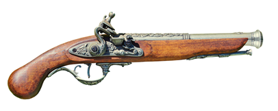

# 프로젝트명: Dungeon Walker

# [ 목차 ]
### 1. [컨셉](#1)
### 2. [관련 동영상](#2)
### 3. [대표 이미지 그리고 컨셉과 대표이미지 기반 작품 묘사](#3)
### 4. [Dungeon Walker의 구성 요소](#4)
### 5. [게임 시스템 디자인](#5)
### 6. [요구사항(6주차)](#6)
### 6. [요구사항(1년차)](#66)
### 7. [키보드 이벤트에 대한 흐름도](#7)
### 8. [용어 정리](#8)
### 9. [개발 작업](#9)
### 10. [1주차 작업 결과](files/w01/index.md)
### 10. [2주차 작업 결과](files/w01/w02.md)
### 10. [3주차 작업 결과](files/w01/w03.md)
### 10. [4주차 작업 결과](files/w01/w04.md)
### 10. [5주차 작업 결과](files/w01/w05.md)
### 10. [6주차 작업 결과](files/w01/w06.md)

# [컨셉] 

## 메인컨셉 : 랜덤

- ‘무작위의’ 의미를 가진 단어이며 ‘로그라이크’ 라는 장르에 가장 중요한 요소로
   플레이 중 적과 플레이어를 강화하는 요소가 무작위로 등장
   
### 서브 컨셉 1 : 난이도

- 어느정도 어렵게 만들어 게임을 지루하지 않게 개발

### 서브 컨셉 2 : 복잡성

- 게임을 클리어하는데 한 가지의 방법만이 아닌 여러 가지 방법을 제시

### 서브 컨셉 3 : 탐험

- 무작위로 정해지는 지형으로 플레이어가 새 게임을 시작할 때마다 새로운 경험을 하게 만듬

### 서브 컨셉 4 : 성장

- 캐릭터를 강화하는 요소가 랜덤으로 나와 매번 다르게 성장하는 재미

### 서브 컨셉 5 : 영구적 죽음

- 게임에서 사망할 경우 진행했던 모든 것이 사라지며 새 게임을 진행해야 한다

  

# [관련 동영상] 

- 동영상

  

  

# [대표 이미지] 

  

# [컨셉 & 대표이미지 기반 작품묘사]

> ### 대표이미지 기반 : 
> 화면 왼쪽위에 체력과 지구력을 표시한 ui가있고 중앙엔 유저의 캐릭터 주변엔 적 캐릭터가 있다.
  왼쪽아래에는 현재 플레이어가 무슨 무기를 들고있는지 표시해주고 오른쪽아래에는 가지고있는 체력을 회복시켜주는 물약의 개수가 표시되어 있다. 

> ### 컨셉 기반:

  

# [Dungeon Walker 구성 요소] 

- 캐릭터를 성장시키며 강력한 보스에게 도전하는 액션 로그라이크게임

 

## 1. 메커니즘

[도전 과제]

낮은 기본 능력치로 초반 어려운 난이도로 진행하며
게임이 진행될수록 강해지며 보스를 처치하여 게임을 클리어

[재미 요소]

게임을 진행하며 랜덤한 성장요소로 강해지는 캐릭터

 

## 2. 이야기

[만들게 된 배경]  
평소 로그라이크 장르의 게임을 했었을 때 
나도 언젠가 한번 로그라이크 게임을 만들어보고 싶다 라고
생각했었기에 이번 기회에 만들어보자 라고 생각했다

[카메라 관점]  
기본적으로 쿼터뷰이며 이는 게임중 변할수도있다

 

## 3. 미적요소

[디자인][컬러]  
어두운 지하유적을 배경으로 디자인할 예정이며
흑색과 검은색의 돌벽,바닥에 횃불느낌을 내도록 주황색 광원효과를 줄 예정이다

[음향]  
현실적인 묵직한느낌의 효과음
 

## 4. 기술

Unity

# [게임 시스템 디자인] 

# 1. 게임 오브젝트 분해 (구성 요소 분석)

|연번|오브젝트 이름|오브젝트 이미지|
|:----:|:----:|:----:|
|1|Player||
|2|Sword||
|3|Gun||
|4|Enemy||

# 2. 파라미터(속성) 뽑아 보기

1) 오브젝트 이름 : Player

|속성|영문명칭|설명|비고|
|:----:|:----:|:----:|:----:|
|체력|p_HP|플레이어의 체력이며, 1미만일 경우 게임오버된다.||
|지구력|p_SP|플레이어의 지구력이며, 일정이상일 경우 회피를 할 수 있다.||
|이동속도|p_Speed|플레이어의 이동속도이며, 높을수록 캐릭터의 움직이는 속도가 빨라진다.||

2) 오브젝트 이름 : Sword

|속성|영문명칭|설명|비고|
|:----:|:----:|:----:|:----:|
|위력|s_Dmg|근접공격의 위력이며, 수치가 높을수록 적에게 더 큰 피해를 입힐 수 있다.||
|사거리|s_Range|근접공격의 사거리이며, 수치가 높을수록 더 넓은 범위로 공격을 할 수 있게된다.||
|공격속도|s_Speed|근접공격의 공격속도이며, 수치가 높을수록 더 빠른속도로 공격할 수 있다.||

3) 오브젝트 이름 : Gun

|속성|영문명칭|설명|비고|
|:----:|:----:|:----:|:----:|
|위력|g_Dmg|원거리공격의 위력이며, 수치가 높을수록 적에게 더 큰 피해를 입힐 수 있다.||
|사거리|g_Ammo|원거리공격의 탄약이며, 1미만일 경우 원거리공격을 할 수 없게된다.||
|공격속도|s_Reload|원거리공격의 장전속도이며, 수치가 높을수록 더 빠른속도로 장전하여 더 빠르게 공격할 수 있다.||

4) 오브젝트 이름 : Enemy

|속성|영문명칭|설명|비고|
|:----:|:----:|:----:|:----:|
|체력|e_HP|적의 체력이며, 1미만일 경우 소멸한다.||
|위력|e_Dmg|적의 위력이며, 수치가 높을수록 플레이어에게 입히는 피해가 커진다.||
